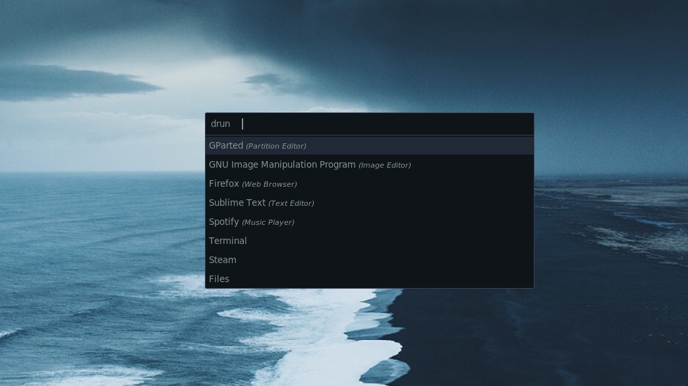

**Neurosis rofi theme**

A minimalistic dark [rofi](https://github.com/DaveDavenport/rofi) theme.

**Installation**

To install the theme put `neurosis.rasi` in `.config/rofi/themes`.

To select the theme add `rofi.theme: ~/.config/rofi/themes/neurosis.rasi` in your rofi config file (`~/.config/rofi/config`) or select the theme using `rofi-theme-selector`.
